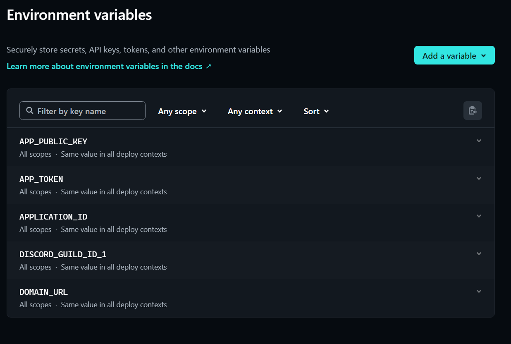
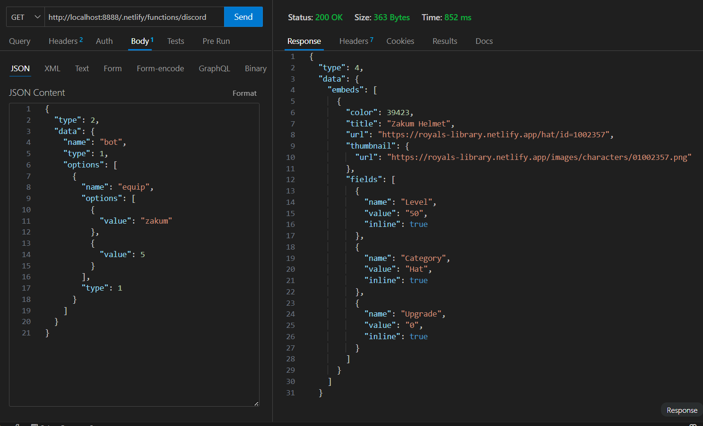
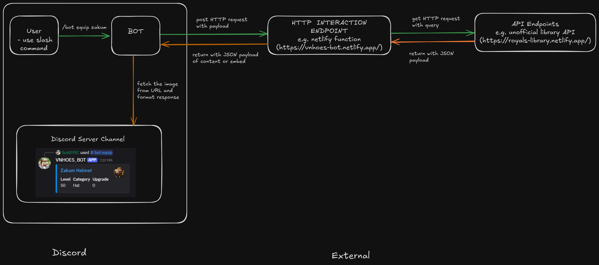

# MR_discord_bot_netlify

A discord bot to be hosted at netlify as netlify function
- interacts with unofficial mapleroyals library API
- stateless, no backend hosting needed
- supports following slash command

```
  /bot help             : show help
  /bot equip xxxx       : search and return 1st equip
  /bot item xxxx        : search and return 1st item
  /bot monster xxxx     : search and return 1st monster
  /bot skill xxxx       : search and return 1st skill
  /bot music xxxx       : search and return 1st music
  /bot servertime       : show mapleroyals servertime
  /bot roll min max     : roll a number between, up to -10b ~ 10b
  /bot flipcoin         : flip a coin
  /bot selftest         : healthcheck if this BOT is OK
  /bot author           : show author

  # drop
  /drop equip xxxx      : show which mobs drop the equip
  /drop item xxxx       : show which mobs drop the item
  /drop mob xxxx        : show drops of a mob 

  # guide
  /guide apq            : link to apq guide
  /guide apqbon         : show apq bonus map
  /guide cwk            : link to cwkpq guide
  /guide cwkbon         : show cwkpq bonus map
  /guide gpq            : link to gpq guide
  /guide gpqbon         : show gpq bonus map
  /guide opq            : link to opq guide
  /guide lpq            : link to lpq guide
  /guide mage1hit       : show mage1hit table
  /guide reuel          : link to Reuel hp quest
  /guide leech          : show leech picture
  /guide price          : link to Sylafia price guide
  /guide jobadvance     : link to job advance guide
  /guide hpwashinfo     : show hp wash info table
  
  # troll
  /troll pavoweme       : show how much pav owes me
  /troll pavoweeveryone : show how much pav owes everyone
  /troll pavfeels       : show pav feeling today
  /troll sackpav        : sack a random BOSS on Pav

```

## Prerequisite :
1. install latest Node.js
1. register discord account
1. register netlify account

## Installation :
### Part 1: Hosting
1. fork a copy
1. create a Discord App at https://discord.com/developers/applications 
1. publish this repo to netlify, your Interaction Endpoint URL would be: `https://<your domain>/.netlify/functions/discord`
1. get app token from Discord Dev -> App -> BOT
1. update netlify environment variable, refer to `env_example` file
    - 
1. trigger re-deploy
1. enter your Interactions Endpoint URL at your Discord App -> General Information Tab -> Interactions Endpoint URL, if prompt error, please settle before proceed

### Part 2: Register Slash Command
1. At your local repo, run `npm install`
1. create a .env file, using same secret as your netlify environment variables, refer to env-example
1. invite Discord App to your discord server with OAUTH generated URL from 
    - Discord Dev -> App -> OAUTH2 -> SELECT BOT -> SELECT TEXT PERMISSION : send messages/embed links/use slash commands
    - access generated url
1. run `node ./register_command.js` to register command to your discord server
1. run `/bot help` in your discord server, if it responds, congrats.

## Local Development
1. run `npm install`
1. run `npm install -g netlify-cli`
1. At your local repository, create a `.env` file, using same secret as your netlify environment variables, refer to `env-example file`, except DOMAIN_URL to be http://localhost:8888
1. run `netlify dev` to host local dev server
1. use postman or thunderclient to send payload to your dev server as this:

1. Entry point is /netlify/functions/discord.js, localhost dev server would bypass discord verification
1. be creative for new slash command! 
- P/S: Whenever you finish creating a function for a new command, please update file `register_command.js` accordingly, and run `node ./register_command.js`, else your discord server won't have it

## Test
1. update DOMAIN_URL in your .env file to http://localhost:8888
1. run `netlify dev` to host local dev server
1. at another command window, run `npm run test` for overall test
    - you can point DOMAIN_URL to actual hosting domain too, but netlify function (free tier) would need 2~3 time trigger sometimes
1. run `npm run jest` for local debugging

## System overview


## Future works
1. discord server id whitelist feature - if need control on your bandwidth, especially when publish to community 